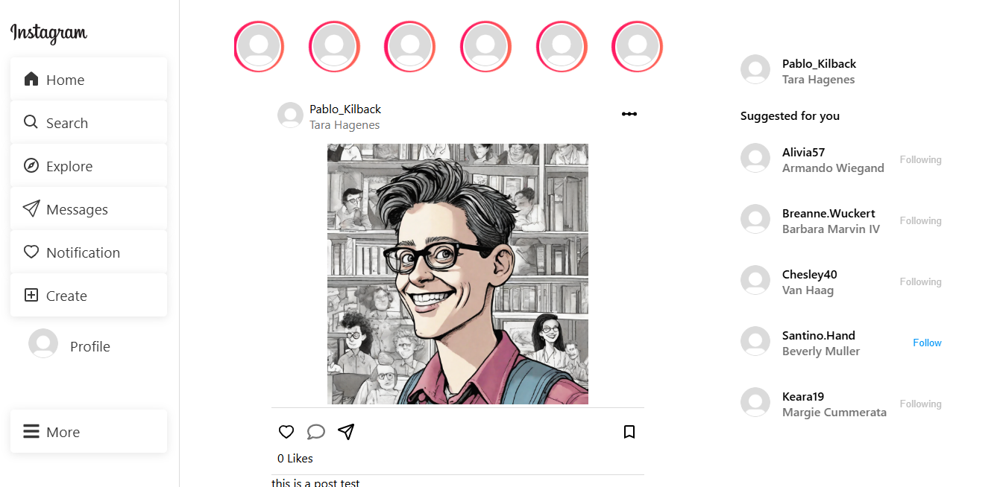
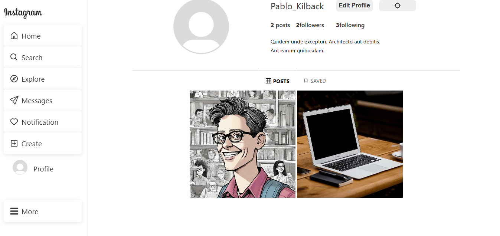
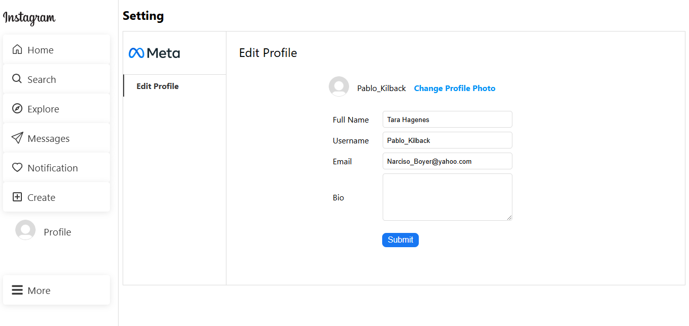
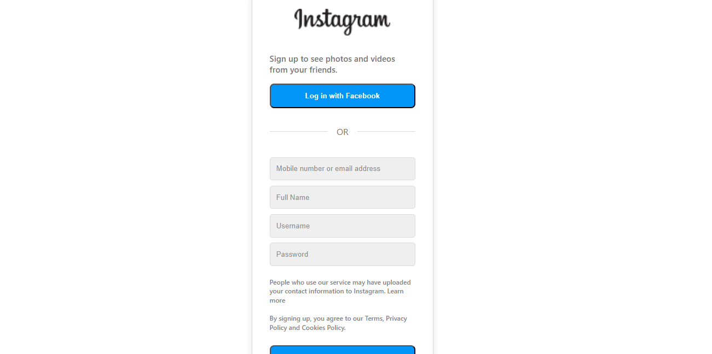

# MERN Instagram Clone App

A full-stack Instagram clone built using the MERN (MongoDB, Express, React, Node.js) stack, featuring authentication, posts, likes, comments, and profile management.

## Features

- User Authentication (JWT-based login & signup)
- Create, read, update, and delete posts (CRUD operations)
- Like and comment on posts
- Follow and unfollow users
- Secure password hashing (bcrypt)
- Image upload functionality (Cloudinary integration)
- Responsive UI with Sass

## Tech Stack

### Frontend

- React.js with Vite
- React Router for navigation
- Redux for state management
- CSS & SASS for styling

### Backend

- Node.js with Express.js
- MongoDB with Mongoose
- JWT for authentication
- bcrypt for password hashing
- Cloudinary for image uploads
  
## Installation

### Prerequisites

Make sure you have the following installed:

- Node.js (>= 14.x)
- MongoDB (local or cloud instance)
- Cloudinary account (for image storage)

### Clone the Repository

```bash
$ git clone https://github.com/radouanMarour/mern-instagram-clone.git
$ cd instagram-clone-app
```

### Backend Setup

```bash
$ cd backend
$ npm install
$ touch .env  # Create an environment file
```

Add the following environment variables to `.env`:

```env
MONGODB_URI=your_mongodb_connection_string
JWT_SECRET=your_jwt_secret_key
CLOUDINARY_CLOUD_NAME=your_cloudinary_cloud_name
CLOUDINARY_API_KEY=your_cloudinary_api_key
CLOUDINARY_API_SECRET=your_cloudinary_api_secret
```

Run the backend server:

```bash
$ npm start
```

### Frontend Setup

```bash
$ cd frontend
$ npm install
$ npm run dev
```

## API Endpoints

### Auth Routes

- `POST /api/auth/signup` - Register a new user
- `POST /api/auth/login` - Login user

### User Routes

- `GET /api/users/:id` - Get user profile
- `PUT /api/users/follow/:id` - Follow a user
- `PUT /api/users/unfollow/:id` - Unfollow a user

### Post Routes

- `POST /api/posts` - Create a new post
- `GET /api/posts` - Get all posts
- `GET /api/posts/:id` - Get a single post
- `PUT /api/posts/:id/like` - Like or dislike a post
- `PUT /api/posts/:id/save` - Save a post
- `POST /api/posts/:id/comment` - Comment on a post

## Screenshots

### Home Page


### Profile Page


### Edit Profile Page


### Explore Page


### Signup Page


### Login Page


## License

This project is licensed under the MIT License - see the [LICENSE](LICENSE) file for details.

## Contributing

Feel free to fork this project, raise issues, and submit pull requests.

## Contact

For any questions, reach out at [radwanmr7@gmail.com](mailto\:radwanmr7@gmail.com).

